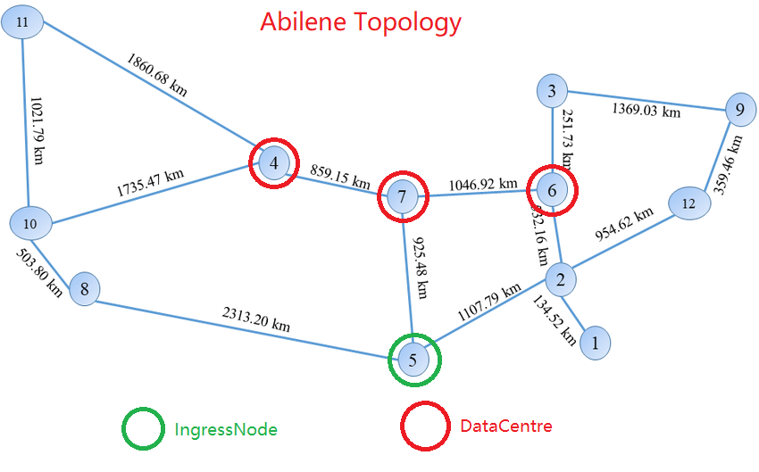
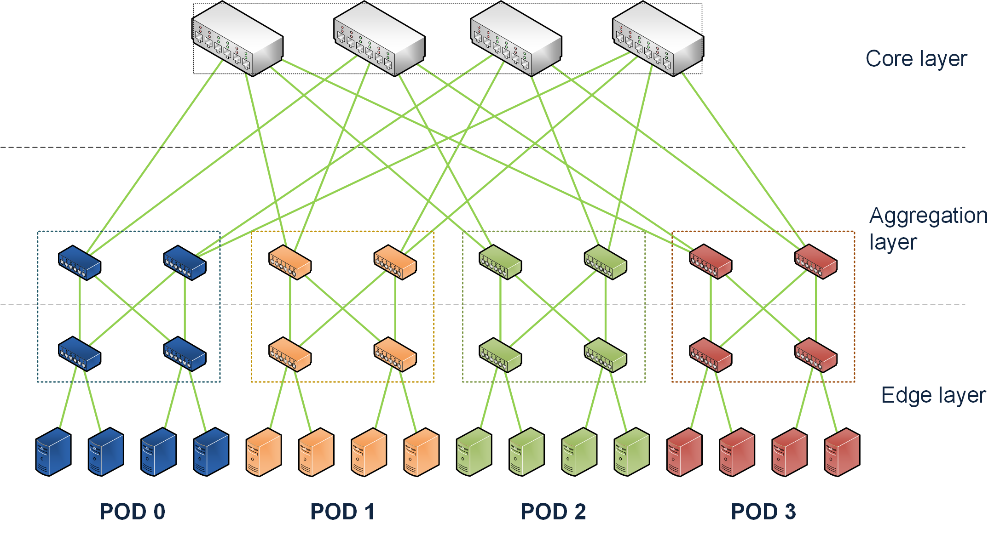
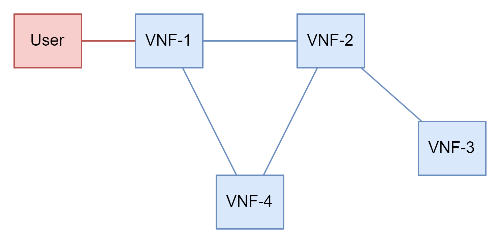
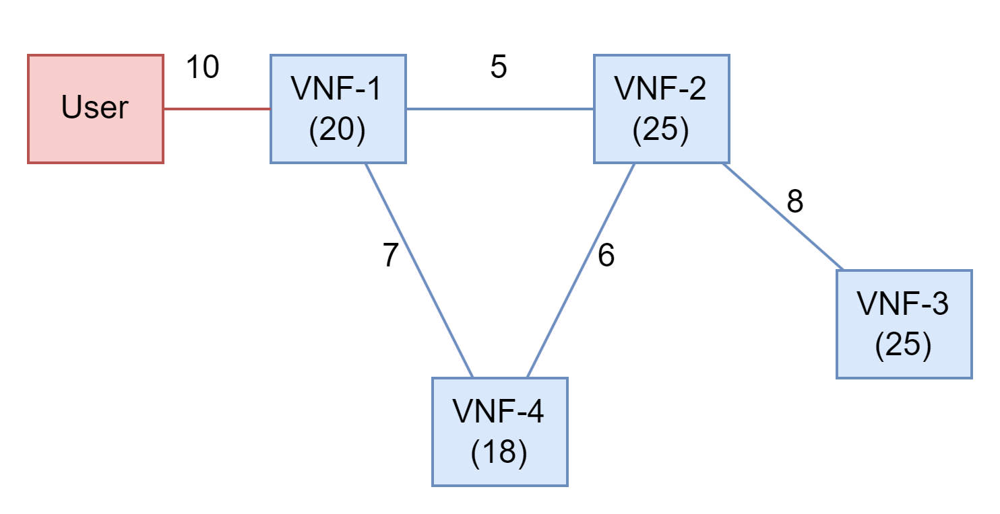
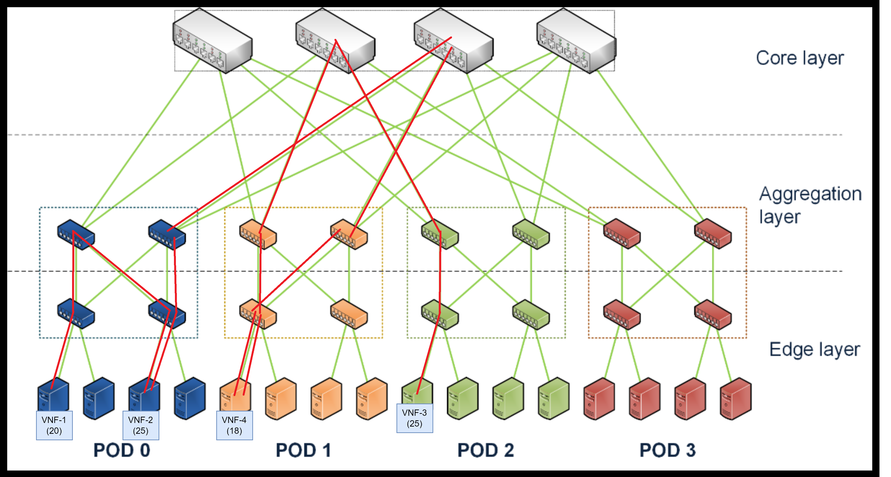
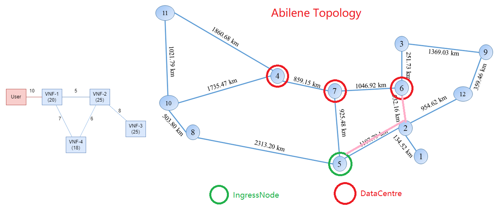
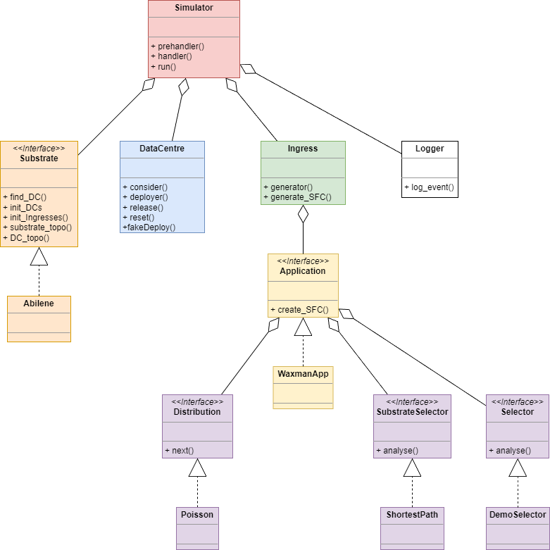
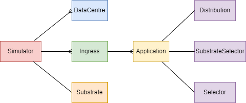

# Cloud Resource Allocation Simulator

Tài liệu này trình bày về công cụ mô phỏng việc cấp phát tài nguyên trong hệ thống Edge - Cloud, phục vụ cho một công bố khoa học của phòng nghiên cứu Future Internet Lab, Đại học Bách Khoa Hà Nội.

## 1. Bài Toán

Bài toán chúng tôi giải quyết có dạng như “Bài toán xếp thùng” (Bin Paking Problem).

Kịch bản được mô phỏng trên các topo mạng Backbone trong thực tế, hay SubstrateTopo. Hình dưới đây là topo Abilene được triển khai tại nước Mỹ



Các node màu xanh lá (IngressNode) là các node tạo yêu cầu, các node màu đỏ là các Trung tâm dữ liệu (DataCentre), các node còn lại đóng vai trò các trạm trung chuyển (Router). Yêu cầu được tạo ra từ các IngressNode là các chuỗi dịch vụ (SFC) gồm các VNF, cần được triển khai tại các DataCentre. Thời gian tạo ra các SFC tại các IngressNode tuân theo phân phối Gauss. Các đường mạng nối giữa các Node có tài nguyên được biểu thị bằng Băng thông tối đa (Bandwidth).

Mỗi DataCentre có lượng tài nguyên (compute, network) cố định, được tổ chức gồm các Server và Router theo mô hình Fattree. Các Server có tài nguyên được biểu thị bằng Compute (tối đa là 100), các đường mạng nối giữa các SErver và Router có tài nguyên được biểu thị bằng Băng thông tối đa (bandwidth)



Các SFC gồm các VNF nối với nhau theo Topo Waxman. Mỗi VNF tiêu thụ một lượng tài nguyên Điện toán và các đường mạng nối giữa các VNF (màu xanh lam) tiêu thụ một lượng băng thông trong các DataCentre. Ngoài ra, đường mạng màu đỏ nối từ User tới chuỗi SFC cũng yêu cầu một lượng băng thông trong SubstrateTopo.



Công cụ mô phỏng của tôi được áp dụng để giải hai bài toán sau:

- Khi các SFC được tạo ra, cần chọn DataCentre nào để triển khai SFC này.
- Sau khi DataCentre được chọn, các VNF được triển khai như nào trên hệ thống Server trong DataCentre đó.

### 1.1. Mô phỏng triển khai SFC trong DataCentre

Giả sử DataCentre được tổ chức theo Fattree cấp 4, với mỗi Server có tài nguyên Điện toán là 100, băng thông trên các liên kết mạng tối đa là 100Mbps. Xét SFC có topo và yêu cầu tài nguyên như sau:



Giả sử SFC được triển khai trong DataCentre theo sơ đồ sau: Khi đó các đường màu đỏ thể hiện tài nguyên băng thông bị chiếm dụng khi triển khai SFC lên DataCentre này. Chú ý các đường màu đỏ trong hình bên dưới tương ứng với các đường màu xanh trong sơ đồ yêu cầu tài nguyên SFC bên trên.



Công cụ mô phỏng cho phép triển khai thuật toán để deploy SFC lên một DataCentre, trong đó bao gồm việc lựa chọn các Server để deploy các VNF và thực hiện định tuyến giữa các VNF này trên hệ thống mạng Fattree trong DataCentre.

### 1.2. Mô phỏng lựa chọn DataCentre để triển khai SFC

Ta vẫn sử dụng sơ đồ yêu cầu tài nguyên của SFC như bên dưới. Giả sử một SFC được sinh ra tại vị trí IngressNode số 5 và cần được deploy vào một trong ba DataCentre 4, 7, 6. Công cụ cho phép ta triển khai thuật toán lựa chọn DataCenter để deploy SFC đó. Giả sử vị trí DataCentre được lựa chọn là 6 và định tuyến cho kết quả đường đi là 5-2-6. Hình vẽ bên dưới với đường màu hồng thể hiện các đường kết nối mạng bị tiêu thụ tài nguyên băng thông, ở đây là 10Mbps tương ứng với giá trị đường màu đỏ trong sơ đồ SFC.



## 2. Công cụ mô phỏng

Sơ đồ thiết kế hướng đối tượng:



Mỗi quan hệ giữa các khối:



### 2.1. Chức năng chính của các Khối

- **Simulator**: Class chính điều phối các hoạt động của Công cụ mô phỏng
- **Substrate**: đại diện cho một SubstrateTopo (Backbone Topo)
- **DataCentre**: đại diện cho các DataCentre
- **Logger**: thực hiện việc ghi log kết quả
- **Ingress**: đại diện cho các IngressNode
- **Application**: là một thuộc tính của Ingress, chứa các đặc trưng của các SFC được tạo ra như topo bên trong các SFC, phân phối của SFC theo thời gian, thuật toán deploy SFC vào DataCentre
- **Distribution**: thuộc tính của Application, là các phân phối tạo SFC tại các IngressNode.
- **Selector**: các thuật toán triển khai SFC vào DataCentre.

### 2.2. Triển khai các tham số và mô phỏng

Mẫu triển khai mô phỏng giống như file example.py

### 2.3. Chương trình bắt đầu với lệnh gọi Simulator.run() từ file main (ở đây là example.py)

```python
sim = Simulator(substrate, folder_log, logging.DEBUG, True, *argument)
sim.run(runtime)
```

Simulator gọi tới phương thức Ingress.generator() của từng IngressNode. Phương thức này tạo ra các Simpy process Ingress.generate_SFC() liên tục tạo ra các SFC theo phân phối định trước suốt thời gian mô phỏng. Mỗi Application sẽ có một process, do đó mỗi lần gọi Ingress.generator() có thể tạo nhiều tiến trình generate_SFC()

```python
for ingress in self.Ingresses:
    ingress.generator(self)
```

Các SFC được tạo ra sẽ được đưa vào một queue chung của toàn Simulator, là Simulator.reqQueue()

```python
def generate_SFC(self, sim, app):
    while True:
        .
        .
        .
        sim.reqQueue.put(sfc)
```

Sau khi các tiến trình tạo SFC được khởi tạo xong, Simulator bắt đầu mô phỏng

```python
self.env.process(self.prehandler())
startTime = int(time.time())
self.env.run(until=runtime)
endTime = int(time.time())
self.logger.close()
```

Simpy Process được chạy là **Simulator.prehandler()**. **Simulator.prehandler()** dựa vào tham số **Simulator.strategy** để lựa chọn hành vi khi có SFC mới đi vào hệ thống, với 1 là deploy luôn SFC vào hệ thống và 2 là redeploy toàn bộ hệ thống. Quá trình redeploy bao gồm gỡ toàn bộ SFC ra khỏi hệ thống và deploy lại từ đầu, trong khi đó strategy 1 chỉ đơn giản gọi tiếp tới hàm **Simulator.handler()**

**Simulator.handler()** thực hiện các công việc sau:

- Đưa SFC tới từng DC để xử lí xem có khả năng deploy SFC này lên DC đó hay không
- Nếu không có DC nào có khả năng deploy SFC, từ chối SFC này. Nếu có DC, tiến hành deploy SFC lên DC đó

Mỗi SFC được deploy sẽ được định sẵn thời điểm bị gỡ khỏi hệ thống.

### 2.4. Mô tả chi tiết một số khối

**2.4.1. Simulator**

**Simulator.prehandler()**

Hàm này tiến hành lấy từng SFC ra khỏi queue để xử lí. Tuỳ vào tham số **Simulator.strategy** mà lựa chọn hành động khi có SFC mới đi vào hệ thống, với giá trị của **Simulator.strategy = 1** là tính toán để deploy luôn SFC vào hệ thống, **Simulator.strategy = 2** là có redeploy lại các SFC sẵn có trong hệ thống trước khi xem xét SFC mới. Các kết quả mô phỏng cho thấy, redeploy không mang lại kết quả tốt hơn. Ngoài ra, thay vì phải redeploy lại toàn bộ hệ thống, phương pháp redeploy triển khai trong mô phỏng là chỉ redeploy lại một số SFC cần thiết.

**Simulator.handler()**

Tính toán xem có thể deploy SFC này vào hệ thống được không. Các bước xem xét gồm:

- Chạy thuật toán chọn DC. Bước này gọi tới các hàm **DataCentre.consider()** để tính toán tài nguyên cần thiết để deploy SFC lên mỗi DC. Các tài nguyên của DC sẽ không bị tiêu thụ trong bước này.
- Nếu không có DC nào có khả năng deploy SFC, tiến hành huỷ bỏ SFC này.
- Nếu có DC, tiến hành deploy SFC lên DC đó. Bước này gọi tới hàm **DataCentre.deployer()** để deploy thực sự SFC vào DC. Các tài nguyên của DC sẽ bị tiêu thụ trong bước này.

- Nếu có DC, tiến hành deploy SFC lên DC đó. Bước này gọi tới hàm **DataCentre.deployer()** để deploy thực sự SFC vào DC. Các tài nguyên của DC sẽ bị tiêu thụ trong bước này.

**2.4.2. DataCentre**

**DataCentre.fakeDeploy()**

Deploy thử SFC vào DC. Được gọi lại bởi hàm **DataCentre.consider()** và **DataCentre.deployer()**

**DataCentre.consider()**

Xem xét khả năng có thể deploy được vào DC đó hay không, đồng thời lấy về số liệu Energy khi giả sử SFC được deploy thành công. Khi có được kết quả deploy, các tài nguyên của DC không bị tiêu thụ. Được gọi tới bởi **SubstrateSelector.analyse()** để lọc ra các DC có khả năng tiếp nhận SFC.

**DataCentre.deployer()**

Deploy SFC vào DC, sau đó các tài nguyên của DC sẽ bị tiêu thụ. Được gọi tới bởi **Simulator.handler()** để deploy SFC vào hệ thống.

**DataCentre.realease()**

Chạy như một Simpy process, sẽ giải phóng SFC khỏi hệ thống khi hết thời gian tồn tại của nó.

**2.4.3. Ingress và Application**

Application được sử dụng để đặc trưng cho các SFC. Mỗi Application tương ứng với một kiểu SFC. Một Application sẽ có các thuộc tính:

- Application.distribution: thời gian phân phối SFC theo thời gian
- Application.selector: thuật toán triển khai SFC vào trong DC
- Application.subSelector: thuật toán lựa chọn DC để triển khai SFC
- Application.arg: các tham số phụ thêm đặc trưng cho SFC, nếu cần thiết. Ví dụ đói với SFC Waxman thì cần thêm hai tham số phụ là hệ số alpha và beta trong hàm tạo topo Waxman

- Application.arg: các tham số phụ thêm đặc trưng cho SFC, nếu cần thiết. Ví dụ đói với SFC Waxman thì cần thêm hai tham số phụ là hệ số alpha và beta trong hàm tạo topo Waxman

**2.4.4. SubstrateSelector**

Khối này triển khai thuật toán lựa chọn DC để deploy SFC

**2.4.5. Selector**

Khối này triển khai thuật toán deploy SFC vào DC

### 2.5. Tuỳ biến

Tuỳ biến code dựa trên các code có sẵn. Chú ý các dòng có comment #M ở cuối nên được giữ nguyên.

**2.5.1. Triển khai thuật toán nhúng SFC vào hệ thống Server của DataCentre**

Tạo class kế thừa từ class **Selector** với mẫu giống class **DemoSelector.** Triển khai thuật toán trong **sim.Selector.analyse()**

input:

| parameter | type | description |
| --- | --- | --- |
| DC | sim.DataCentre | Toàn bộ thông tin về DataCentre mà SFC được xem xét nhúng vào, gồm DC.id và DC.topo. Các thuật toán chỉ dùng tới DC.topo. Để không đảm bảo không làm thay đổi giá trị của biến DC gốc, câu lệnh topo = copy.deepcopy(DC.topo) là an toàn và cần thiết. |
| sfcInput | dict | SFCcần được xử lí |

output

| value | meaning |
| --- | --- |
| 1 | DC từ chối deploy vì không đủ capacity |
| 2 | DC từ chối deploy vì không đủ băng thông |
| sfc | DC chấp nhận deploy |

Ngoài mẫu triển khai như **sim.Selector.DemoSelector** còn có thể triển khai theo mẫu **sim.DataCentre.HRE_ver2.** Cần đảm bảo giá trị return đúng như quy ước để đồng bộ hoạt động với các khối khác.

**2.5.2. Triển khai thuật toán lựa chọn DataCentre để deploy SFC**

Tạo một class kế thừa từ **SubstrateSelector** giống với class **ShortestPath.** Triển khai thuật toán trong **sim.SubstrateSelector.analyse()**

input:

| parameter | type | description |
| --- | --- | --- |
| sim | sim.Simulator | Qua tham số này lấy được sim.topology là substrate topo và sim.DataCentres là danh sách các DataCentre để tiến hành thử lần lượt SFC vào các DC này. |
| sfc | dict | sfc cần được xử lí |

output:

| value | meaning |
| --- | --- |
| failed | số DC không deploy được sfc này |
| failDetail | lí do từ chối SFC, dạng list các list, list nhỏ có dạng [DC.id, result], ví dụ [1, 2] nghĩa là tại DC số 1 thiếu tài nguyên cpu, [3, 1] nghĩa là tại DC số 3 thiếu tài nguyên băng thông. failed có thể lớn hơn len(failDetail), khi đó các trường hợp không được đưa vào failDetail là do thiếu băng thông từ Ingress tới DataCentre |
| decision | deploy ở substratetopo như nào, là list các substrate node biểu thị đường đi từ Ingress tới DataCentre được chọn. |

**2.5.3. Tuỳ chỉnh SFC**

SFC được mô hình hoá bởi class **Application**. Một SFC được đặc trưng bởi các tham số:

Lưu ý rằng các thuật toán đều được triển khai cùng với Application, có nghĩa là trong hệ thống có thể có các SFC áp dụng các thuật toán (Selector và SubstrateSelector) khác nhau, cùng chạy trong một lần mô phỏng.

Topo cấu thành SFC được triển khai ở **sim.Application.create_SFC().** Một số Topo SFC cần thêm tham số để khởi tạo. Với dạng Topo nối tiếp (Các VNF nối tiếp nhau) thì không cần tham số thêm, tuy nhiên với topo Waxman cần có thêm hệ số alpha và beta. Hai hệ số này là các thuộc tính không bắt buộc **sim.Application.*arg**

**2.5.4. Triển khai Substrate Topo**

Tạo class kế thừa từ class Substrate như class Abilene. Substrate Topo được triển khai trong **sim.Substrate.substrate_topo()**

**2.5.5. Triển khai Topo bên trong DataCentre thay cho Fattree**

Tạo class kế thừa từ class Substrate như class Abilene. Substrate Topo được triển khai trong **sim.Substrate.DC_topo()**

Một mẫu DataCentre topo sẽ áp dụng cho tất cả các DC còn lại, không thể triển khai mỗi DC một dạng topo khác nhau. Hiện tại Topo đang triển khai trong DC là Fattree, áp dụng cho tất cả các DC trong Simulator, chỉ thay đổi được bậc của topo Fattree này (hệ số k)

**2.5.6. Sử dụng Logger**

Cấu hình file ghi kết quả từ file main (ở đây là example.py).

Simulator sử dụng thư viện **logging** để thực hiện việc ghi log. Bằng việc cài đặt giá trị của **sim.Simulator.logLevel** ta có thể cài đặt các mức độ ghi log, nhiều hơn hoặc ít hơn các dòng log in ra màn hình. Khi cần Debug một tính năng mới nên để các mức log thấp như DEBUG hoặc INFO. Khi thuật toán hoặc tính năng đã triển khai ổn định rồi nên để ở các mức log cao hơn như WARN hoặc ERROR.

Ghi log ra bằng cách gọi tới **sim.Simulator.logger.log_event().** Tuỳ vào action mà ta định nghĩa mức ghi log cho nó trong class **sim.Logger**

**2.5.7. Phương pháp remap (có thể đã được tối ưu hết mức)**

Theo strategy 2, khi có SFC mới vào hệ thống, thay vì redeploy lại toàn bộ hệ thống, ta chỉ cần redeploy lại một số SFC nào đó, còn lại giữa nguyên tình trạng của chúng. Trong thực tế việc này mang lại lợi ích rõ ràng về thời gian cũng như tài nguyên tiêu thụ khi bật - tắt container. Trong mô phỏng, nó tiết kiệm rất nhiều thời gian khi giảm bớt những xử lí thừa thãi, ví dụ, sau khi redeploy, một số (rất nhiều) SFC lại quay lại vị trí cũ.

Phương pháp redeploy được triển khai trong **sim.Simulator.prehandler(),** khi **sim.Simulator.strategy** = 2.

Một số phương pháp redeploy đã thử nghiệm:

- Sau khi gỡ tất cả các SFC ra khỏi hệ thống, deploy lại từ SFC yêu cầu nhiều tài nguyên nhất.
- Deploy lại bắt đầu từ SFC yêu cầu ít tài nguyên nhất.

Các kết quả mô phỏng cho thấy việc redeploy không mang lại kết quả tốt, thậm chí nhiều trường hợp redeploy mang lại acceptance rate thấp hơn không redeploy.

Việc redeploy được kì vọng mang lại kết quả tốt vì sau khi tái phân bổ lại tài nguyên, phần tài nguyên tiêu thụ sẽ không còn bị phân mảnh, kì vọng mang lại nhiều không gian hơn cho các SFC tới sau. Tuy nhiên dường như topo SFC là quá phức tạp để đưa ra dự đoán đơn giản như vậy.