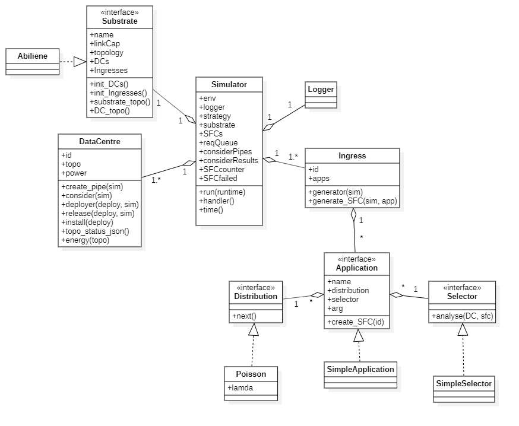

# Cloud Resource Allocation Simulator

## 1. Introduction

This is a Event-based Simulator for Cloud Resource Allocation Problem we researched in this Paper: [Service Function Chain Embedding in Centralized and Distributed Data Centers – a
Comparison]()

## 2. Installation

This Simulator is developed in Python Programming Language, using these Libraries:

* networkx
* simpy
* matplotlib
* numpy

Require Python version >= 3.6

## 3. Structure



* `Simulator`: Control simulator operations, schedule processing of SFCs, log activities, initialize other components of the simulation
* `Logger`: Logging output to file
* `Substrate`: Represents each Substrate Topology (Big Topo), storing the structure of the Substrate and the structure of the DC. Specific Substrates are implemented as Realizations of this class
* `Ingress`: Represents Ingress nodes, having the function of generating SFC according to a given distribution
* `Application`: Definition of the structure and parameters of the SFC
* `Distribution`: generate the interval between 2 SFCs according to the distribution installed as Realizations of this class
* `Selector`: contains the algorithm to put the SFC on the server, the algorithms are implemented as Realizations of this class
* `SubstrateSelector`: contains the DC selection algorithm to set the SFC, the algorithms are implemented as Realizations of this class
* `DataCentre`: represents each DC, consider whether the SFC can be put in, clear the SFC after the SFC TTL timeout

<!-- ## 4. Explaination

* You can run `main_distributed.py` or `main_centrlized.py` or another file with a similar structure

* Simulator starts running when this line in main file is executed:
```python
sim.run(runtime)
```

*  -->

## 4. Customization

* To add your Substrate Topology, create a new class that inherits the **Substrate** class in `Substrate.py` with corresponding methods. Resource specification (capacity of bandwidth) is created in **substrate_topo** method

* By default, Servers and Switches in each Datacentre is organized like Fat-tree Topology. To custom this, edit **DC_topo** method in in your Substrate class

* To add your Distribution, create a new class that inherits the **Distribution** class in `Distribution.py` with corresponding methods.

* Custom Algorithm for placing SFC is implemented as an instance of **Selector** class


<!-- Hướng dẫn chạy công cụ mô phỏng:

tạo file có cấu trúc giống như file main.py, cấu hình tuỳ ý:
    + selector: bộ chọn server, triển khai thuật toán VNF mapping tại đây, mỗi thuật toán tương ứng với một class trong file sim/Selector.py
    + subSelector: bộ chọn DC, mỗi phương pháp chọn DC tương ứng với một class trong file sim/SubstrateSelector.py
    + app: Tập hợp thông số định nghĩa về một SFC, bao gồm: phân phối xuất hiện dist, bộ chọn selector, subSelector, các tham số phụ khác. Mỗi kiểu app tương ứng với một class trong sim/Application.py. Hiện tại công cụ có sẵn kiểu Sequence (các VNF nối đuôi nhau, topo có dạng đường thẳng) và Waxman (SFC được tạo ra là topo random theo thuật toán Waxman)
    + substrate: đại diện cho một substrate topo,

trong hàm main, cấu hình các thông số:
    + dist: Phân phối thời gian giữa hai lần tạo SFC, mỗi phân phối ứng với một class trong sim/Distribution.py
    + avg_TTL thời gian tồn tại trung bình của mỗi SFC
    + n_VNFs: khoảng random số VNF mỗi SFC
    + demand_VNF: tài nguyên CPU yêu cầu của mỗi VNF
    + bw: khoảng băng thông yêu cầu của mỗi SFC
    + runtime: thời gian chạy mô phỏng, tinh bằng phút
    + appArgs: các thông số phụ của app -->